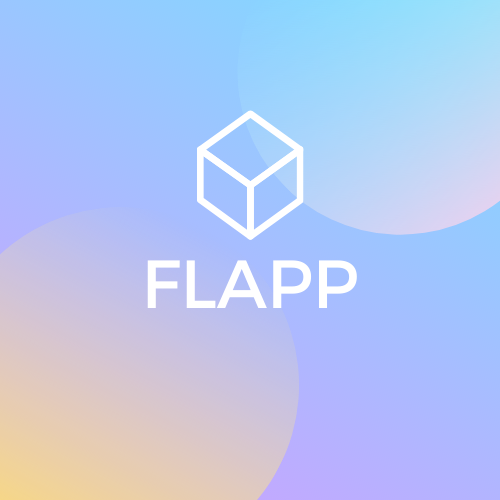

# Project_FleetManagementApp

<!-- # Project_Flapp
### Fleet Management App -->
<!--  -->
<!-- PROJECT LOGO -->
 

    

  <h3 align="center">Fleet Management App</h3>

<!-- Feedback -->
<!-- [ ] Empty [x] Full -->

## ToDo's
* GeefBestuurder methode
* RijbewijsTypeRepo klassen afwerken
* IRijbewijsTypeRepo interface maken
* Alle methode's met NotImplementedException() maken
* Geef Voertuig & Tankkaart methode maken

## Feedback: 21/10
- [ ] Voor alle klassen een unit test
- [ ] Bestuurder heeft voertuig en voertuig heeft dezelfde bestuurder.
- [ ] Tankkaart heeft bestuurder en bestuurder heeft dezelfde tankkaart.
- [ ] Datamodellen maken
- [ ] Print klassendiagram & datalaag modellen

## Feedback: Les 2

- [ ] Deadline -> 12 weken
- [x] RijksregisternummerChecker
- [x] ChasisnummerChecker
- [x] NummerplaatChecker
- [x] Github Commits
- [x] Exceptions opkuisen
- [x] Adres, Brandstof, RijbewijsType -> _Models_
<!-- [ ] Empty [x] Full -->
